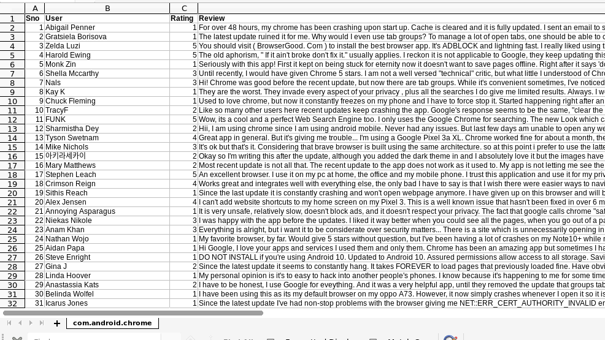

# ReviewScrapper

Automated Playstore Reviews Scrapper using python3 and Selenium. And saves the revies to a csv file for further Data Exploration!

You can play with **no_of_pagedowns** in main.py for more reviews but don't use very high number it will cause memory error i tried alot and choosen 400 pagedowns you can choose with your own.
  
  > It is like no_of_pagedowns = 400

  

# Requirements

    
    - sudo apt-get install chromium-chromedriver
    - Modules specified in requirements.txt

    

# Usage

    
    * git clone https://github.com/swaroopmaddu/PlaystoreReviewsScrapper.git pyscrapper

    * virtualenv -p python3 pyscrapper/
    
    * cd pyscrapper/

    * source bin/activate

    * pip install -r requirements.txt 

    * python main.py

    * Provide application ID and wait for result..!
   

# Note
  Let me know if anything fails.
